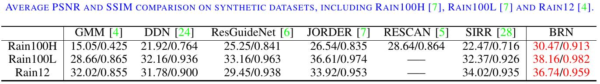
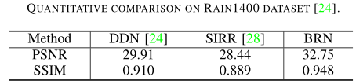
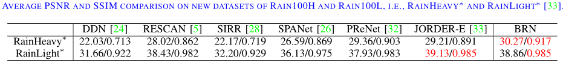
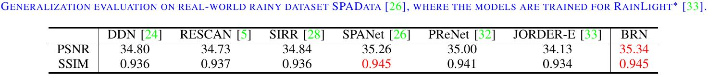

## Single Image Deraining Using Bilateral Recurrent Network
### Introduction
In this work, we first propose a single recurrent network (SRN) by recursively unfolding a shallow residual network, where a recurrent layer is adopted to propagate deep features across multiple stages.
This simple SRN is effective not only in learning residual mapping for extracting rain streaks, but also in learning direct mapping for predicting clean background image. Furthermore, two SRNs are coupled to simultaneously exploit rain streak layer and clean background image layer. 
Instead of naive combination, we propose bilateral LSTMs, which not only can respectively propagate deep features of rain streak layer and background image layer acorss stages, but also bring the interplay between these two SRNs, finally forming bilateral recurrent network (BRN).
The experimental results demonstrate that our SRN and BRN notably outperform state-of-the-art deep deraining networks on synthetic datasets quantitatively and qualitatively. The proposed methods also perform more favorably in terms of generalization performance on real-world rainy dataset. 


## Prerequisites
- Python 3.6, PyTorch >= 0.4.0
- Requirements: opencv-python, tensorboardX
- Platforms: Ubuntu 16.04, cuda-8.0 & cuDNN v-5.1 
- MATLAB for computing [evaluation metrics](statistic/)


## Datasets

SRN and BRN are evaluated on seven datasets*: 
Rain100H [1], Rain100L [1], RainHeavy*[5], RainLight*[5], Rain12 [2], Rain1400 [3] and SPA-data [4]. Please download the testing datasets from [BaiduYun](https://pan.baidu.com/s/1J0q6Mrno9aMCsaWZUtmbkg)
or [OneDrive](https://1drv.ms/f/s!AqLfQqtZ6GwGgep-hgjLxkov2SSZ3g), download the RainHeavy*[5] and RainLight*[5] from [here](http://www.icst.pku.edu.cn/struct/Projects/joint_rain_removal.html), and download the testing generalization dataset SPA-data [4] from [GoogleDrive](https://drive.google.com/drive/folders/1eSGgE_I4juiTsz0d81l3Kq3v943UUjiG).
And then place the unzipped folders into './datasets/'. Make sure that the path of the extracted file is consistent with '--data_path'. 

*_We note that:_

_(i) The datasets of Rain100H and Rain100L have been updated by the authors. We notate them as RainHeavy* and RainLight*, that can be downloaded from [here](http://www.icst.pku.edu.cn/struct/Projects/joint_rain_removal.html)._

_(ii) We upload the old datasets of Rain100H and Rain100L to [BaiduYun](https://pan.baidu.com/s/1J0q6Mrno9aMCsaWZUtmbkg)
or [OneDrive](https://1drv.ms/f/s!AqLfQqtZ6GwGgep-hgjLxkov2SSZ3g). For Rain100H, we strictly exclude 546 rainy images that have the same background contents with testing images._
  

        

## Getting Started

### 1) Testing

We have placed our pre-trained models into `./logs/`. 

Run shell scripts to test the models:
```bash
bash test_RainHeavy.sh   # test models on RainHeavy
bash test_RainLight.sh   # test models on RainLight
bash test_Rain100H.sh   # test models on Rain100H
bash test_Rain100L.sh   # test models on Rain100L
bash test_Rain12.sh     # test models on Rain12
bash test_Rain1400.sh   # test models on Rain1400
bash test_real.sh       # test models on SPA-data
```

_(i) On RainHeavy* [5] and RainLight* [5], we re-train all the competing methods. We have uploaded all the trained models to [`./logs/RainHeavy/`](logs/RainHeavy/) and [`./logs/RainLight/`](logs/RainLight/). You can use their source codes to reproduce the results in the paper._

_(ii) All the results in the paper are also available at [GoogleDrive](https://drive.google.com/drive/folders/1pIDsc8VPRO5VFNDEoO16ukoaAB4Dsuqt). You can place the downloaded results into `./results/`, and directly compute all the [evaluation metrics](statistic/) in this paper._

### 2) Evaluation metrics

We also provide the MATLAB scripts to compute the average PSNR and SSIM values reported in the paper.
 

```Matlab
 cd ./statistic
 run statistic_RainHeavy.m
 run statistic_RainLight.m
 run statistic_Rain100H.m
 run statistic_Rain100L.m
 run statistic_Rain12.m
 run statistic_Rain1400.m
 run statistic_real.m
```
###











## References
[1] Yang W, Tan R, Feng J, Liu J, Guo Z, and Yan S. Deep joint rain detection and removal from a single image. In IEEE CVPR 2017.

[2] Li Y, Tan RT, Guo X, Lu J, and Brown M. Rain streak removal using layer priors. In IEEE CVPR 2016.

[3] Fu X, Huang J, Zeng D, Huang Y, Ding X, and Paisley J. Removing rain from single images via a deep detail network. In IEEE CVPR 2017.

[4] Wang T, Yang X, Xu K, Chen S, Zhang Q, and Lau R. Spatial attentive single-image deraining with a high quality real rain dataset. In IEEE CVPR 2019.

[5] Yang W, Tan R, Feng J, Liu J, Yan S, and Guo Z. Joint rain detection and removal from a single image with contextualized deep networks. IEEE T-PAMI 2019. 
